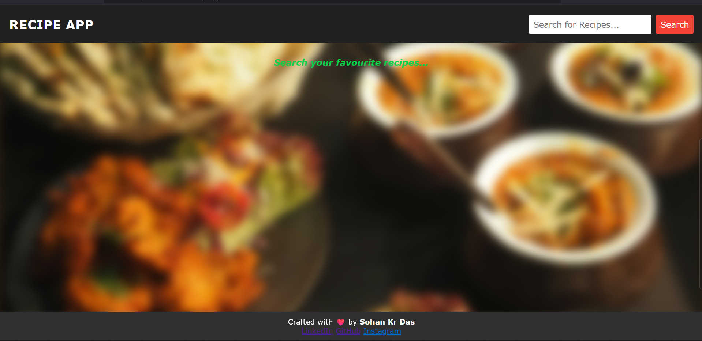
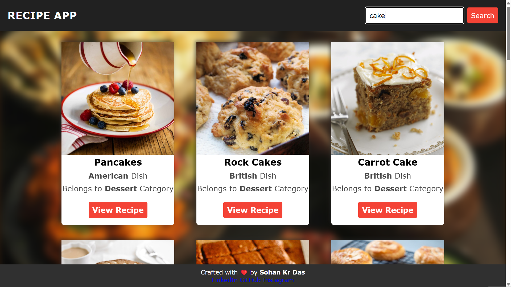
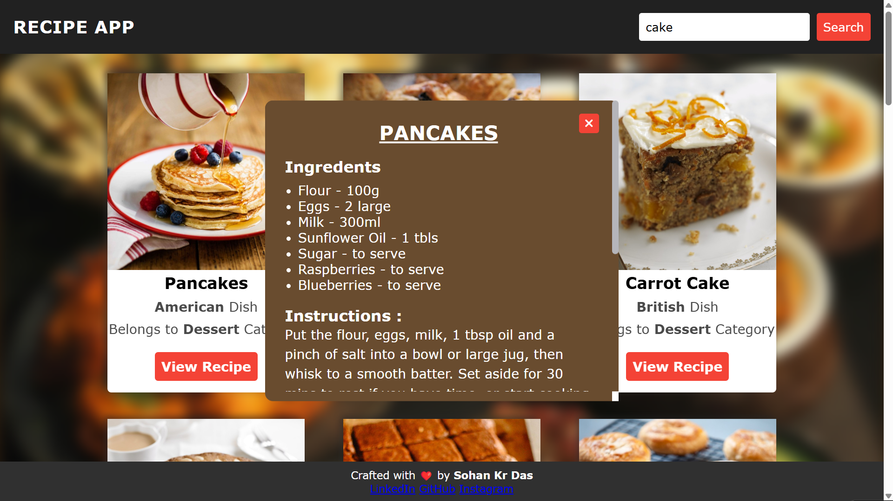

<div align="center">
  <h1>🍽️ Recipe Delight</h1>
  <p>Discover delicious recipes with ease!</p>
</div>

 # ✨ Features

*   🔍 **Smart Search:** Find recipes by keyword.
*   📖 **Detailed Views:** Explore ingredients and instructions.
*   📱 **Responsive Design:** Looks great on any device.
*   📡 **TheMealDB API:** Powered by a vast recipe database.


# 🚀 Tech Stack

*   **HTML5:** Semantic structure.
*   **CSS3:** Beautiful styling & responsiveness.
*   **JavaScript:** Dynamic functionality.
*   **TheMealDB API:** Recipe data source.
## 🖼️ Screenshots

<table align="center">
  <tr>
    <td>
      <b>Home</b><br>
      
    </td>
    <td>
      <b>Recipes</b><br>
      
    </td>
    <td>
      <b>Recipe Details</b><br>
      
    </td>
  </tr>
</table>

<br>

# 🚀 Getting Started

1. Clone the repository:
   ```bash
   git clone https://github.com/sohankr03/recipeApp.git
   ```

> Note: This project uses the TheMealDB API to retrieve delicious recipes. Explore the API at [TheMealDB](https://www.themealdb.com/).
